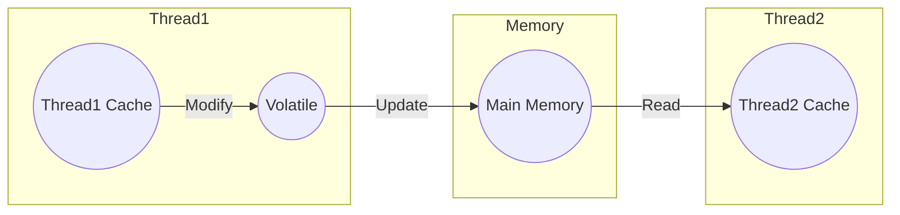

在Java中，Volatile是一种多线程同步的机制。它可以用于解决一个线程写入变量时，另一个线程无法看到该变量的最新值的问题。本篇博客将详细介绍Volatile关键字的用途和工作原理。

## 作用

### 作用：

1. `控制一个变量的可见性`

   当一个线程修改了一个共享变量的值时，JVM不会立即将其更新到主内存中，而是先将其缓存在线程的本地内存中。然而，如果另一个线程想要读取这个变量的值，那么它从主内存中读取的就可能不是最新的值，而是之前缓存在本地内存中的旧值。这就是所谓的“可见性”问题。

   通过将该变量声明为Volatile，可以保证其他线程能够及时看到这个变量的最新值。例如，一个线程正在等待另一个线程更新某个共享变量的值，那么这个共享变量就应该声明为Volatile，确保多个线程之间的可见性。

2. `禁止指令重排序优化`

   在Java中，编译器和处理器都会对代码进行指令重排序优化，以提高程序的执行效率。然而，在多线程环境下，这种优化可能会破坏程序的正确性。当一个变量被声明为Volatile时，编译器和处理器会禁止指令重排序优化，从而确保程序的正确性。例如，一个线程正在等待另一个线程更新某个共享变量，并且这个共享变量的更新需要满足特定的顺序要求，那么这个共享变量就应该声明为Volatile。



Volatile <span style="border-bottom: 2px solid yellow">只能解决可见性问题，而不能保证操作的原子性。</span>如果多个线程同时对同一个Volatile变量进行自增或自减等非原子操作（自身参计算的操作），仍然会出现线程安全问题。



### 图示



在该图中，`Thread1` 和 `Thread2` 分别拥有自己的本地缓存。当 `Thread1` 修改一个 `volatile` 变量时，它会立即将这个变化记录在主内存中，并使其他所有线程的本地缓存的地址设置为无效。

所以，在 `Thread2` 读取相同的 `volatile` 变量时，本地缓存的值已经是无效的了，它只能从主内存中读取最新的值。

这种实时更新确保了所有线程都可以看到对 `volatile` 变量所做的更改，从而避免了竞态条件和数据不一致的情况。

## 实现原理

`Volatile` 关键字的底层实现依靠`CPU的缓存一致性协议`。当一个变量被声明为 Volatile 时，JVM 会向 CPU 发送一条`Lock前缀的指令`，告诉 CPU 这个变量是共享的，并且在读写时需要进行全局同步。

当一个线程写入一个 Volatile 变量时，它会先将新值写入到本地内存中，然后向主内存发送一条写回请求。同时，该线程会将自己的本地内存状态置为“无效”，强制重新从主内存中读取该变量的最新值。

而当一个线程读取一个 Volatile 变量时，它会直接从主内存中读取变量的最新值，并且在读取之前会强制刷新本地内存中所有缓存的数据，以保证读取到的是最新的值。



1. 将当前处理器缓存行的数据写回到系统内存。
2. 这个写回内存的操作会使在其他 CPU 里缓存了该内存地址的数据无效。



## 举个栗子

### 保证可见性

```java
public class VolatileDemo {
    // 声明一个 volatile 类型的变量
    private static volatile boolean flag = false;

    public static void main(String[] args) throws InterruptedException {
        new Thread(() -> {
            while (!flag) {
                // do something...
            }
            System.out.println("Thread 1: flag has been changed to true.");
        }).start();

        Thread.sleep(1000); // 等待一秒钟

        flag = true; // 修改 volatile 类型的变量的值
        System.out.println("Main thread: set flag to true.");
    }
}
```

在该示例中，我们声明了一个静态的 `volatile` 类型的变量 `flag`，并创建了一个新的线程，在这个线程中不断地检查 `flag` 的值。主线程等待一秒钟后，将修改`flag`的值为 `true`。

由于 `flag` 是 `volatile` 类型的变量，任何对它的更改都会立即更新到主内存中，而不是缓存在某个线程的本地内存中。因此，当主线程修改了 `flag` 的值后，新启动的线程可以立即看到这个更改，并退出循环。

通过使用`volatile`关键字来声明变量，我们可以确保变量的最新状态对于所有线程都是可见的，从而避免出现竞争条件和其他问题。

### 防止指令重排

```java
public class VolatileDemo {
    private static volatile VolatileHolder instance;

    public static void main(String[] args) {
        Thread t1 = new Thread(() -> getInstance());
        Thread t2 = new Thread(() -> getInstance());

        t1.start();
        t2.start();

        try {
            t1.join();
            t2.join();
        } catch (InterruptedException e) {
            e.printStackTrace();
        }
    }

    public static VolatileHolder getInstance() {
        // 双重校验锁定模式，实例化对象
        if (instance == null) { // step 1
            synchronized (VolatileDemo.class) {
                if (instance == null) { // step 2
                    instance = new VolatileHolder(); // step 3
                }
            }
        }
        return instance;
    }

    private static class VolatileHolder {
        // some fields and methods
    }
}
```

当没有使用`volatile`关键字时，第一个线程在执行双重检查锁定模式期间，可能会发生以下情况：

1. 线程A执行到第一次检查时，发现instance未被初始化，进入同步块等待。
2. 线程B也执行到第一次检查时，由于instance还未被初始化，也进入同步块等待。
3. 线程A获得锁进入同步块后，进行创建实例对象的操作，但是由于JVM为了提高效率，可能会先分配内存空间、初始化实例、然后再将instance指向该对象。
4. 此时线程B尝试获取锁进入同步块，由于instance已经被分配了空间并被标记为已经初始化，于是直接返回instance的引用，但是此时instance对象尚未完成初始化，访问该对象会出现问题。

### 不保证原子性

```java
public class NotAtomicDemo {
    // 使用 volatile 修饰
    private volatile int count = 0; 

    public void increment() {
        count++; // 自增操作，自身参与操作   == count = count + 1
    }

    public void decrement() {
        count--; // 自增操作，自身参与操作   == count = count - 1
    }
}
```

在这个例子中，`count`变量被声明为`volatile`，因此它的值可以被多个线程共享，并且当一个线程修改了它的值时，其他线程会立即看到最新的值。然而，由于`increment()`和`decrement()`方法都是非原子性的，即它们不是一次性地执行完所有操作，因此在多线程环境下，`count`变量可能会出现并发问题。

例如，当两个线程同时调用`increment()`方法时，它们可能会读取相同的`count`值，增加它，并将结果写回`count`变量。如果这两个线程在同一时间更新`count`变量，则只有一个线程能够成功地将其新值写回变量中，另一个线程的更新将被覆盖。因此，最终的计数器值可能小于预期值。

同样的情况也适用于`decrement()`方法，如果两个线程同时调用该方法，则可能导致计数器值大于预期值。

要解决这个问题，可以使用Java提供的`AtomicInteger`类，或者使用`synchronized`关键字来对`increment()`和`decrement()`方法进行同步，以确保它们被单独执行。

## 总结

Volatile关键字是Java中一种非常重要的多线程并发控制机制，它可以保证多个线程之间的可见性，并且禁止指令重排序优化，从而确保程序的正确性。然而，需要注意的是，Volatile 只能解决可见性问题，不能保证操作的原子性。如果需要保证原子性，需要使用其他的同步机制，例如synchronized或者Lock。

在使用Volatile关键字时，需要特别注意变量的并发读写操作。因为Volatile变量的写入操作会强制刷新本地内存中所有缓存的数据，这可能会导致程序的性能问题。因此，在实际应用中，建议只将必要的共享变量声明为Volatile。

同时，在多线程编程中，需要遵循一定的规范和约束，以避免出现死锁、活锁等常见问题。只有在正确使用各种多线程并发控制机制的基础上，才能写出高效、健壮的多线程程序。