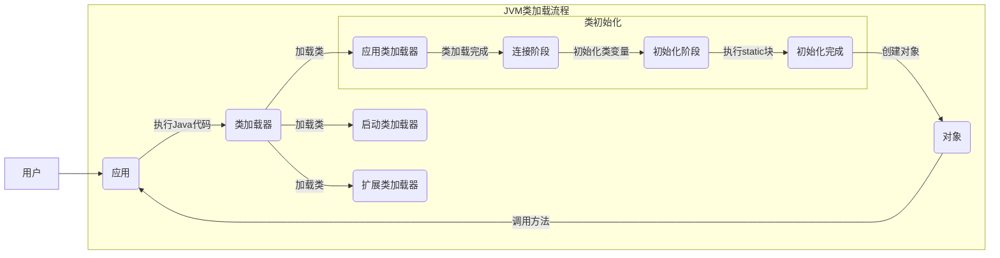
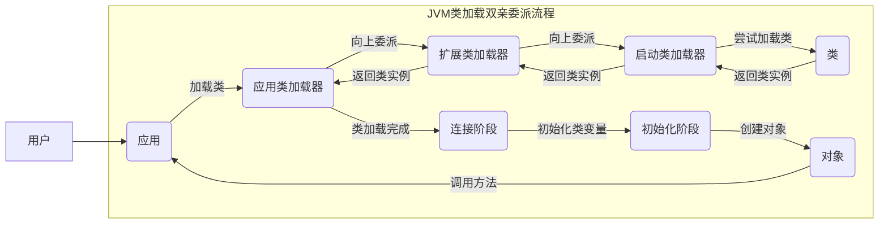

在Java中，类的加载是一个非常重要的过程，其负责将类文件从磁盘读取到内存中，并对其进行解析和初始化。JVM类加载过程一共分为以下三个步骤：加载、连接、初始化。

## 加载

`加载`是指将类文件从文件系统或者网络中读取到内存当中（[`类加载器`](/posts/4f318695/)的功劳），并为之创建一个Class对象。在JVM中，Class对象是用来描述类的，其中包含了类的成员变量、方法等信息。当我们使用new关键字创建对象时，JVM会根据Class对象来实例化该类的对象并返回它。

在类加载时，JVM采用了`双亲委派模型`，即将类的加载任务委派给父类加载器，如果父类加载器无法完成加载任务，才由子类加载器去尝试加载。这种机制可以保证类的唯一性，避免了类的重复加载。

## 连接

`连接`是指将已经读取到内存中的类文件进行校验、准备和解析的过程。

1. **校验（Verification）**：对类文件进行格式的校验，以确保它们符合JVM规范。如果校验失败，则会抛出ClassFormatError异常。
2. **准备（Preparation）**：为类变量分配内存，并设置默认值。在这个阶段，类变量并没有被初始化，只是分配了内存空间。
3. **解析（Resolution）**：将符号引用转化为直接引用的过程。在Java中，使用类名来访问一个类时，实际上是使用了符号引用。而在解析阶段，JVM会将其转化为直接引用，即具体的内存地址或偏移量。

## 初始化

`初始化`是指执行类构造器方法()的过程。该方法由编译器生成，主要负责将类变量赋初值，以及执行静态代码块等操作。

在执行()方法前，JVM会先执行父类的()方法，保证父类的静态成员变量和静态代码块也得到正确的初始化。

在实例化对象时，JVM会首先调用父类的构造器方法，然后再调用子类的构造器方法。在执行构造器方法前，JVM会先执行实例变量初始化和非静态代码块。

## 双亲委派

双亲委派模型是Java类加载机制的核心。该模型是指当一个类加载器收到类加载请求时，它首先将这个请求转发给它的父类加载器，如果父类加载器无法完成类加载任务，才由自己去尝试加载。如下图：

这种机制可以保证类的唯一性，避免了类的重复加载。例如，我们在JVM中使用String类时，它的加载过程如下所示：

1. 如果应用程序类加载器在它的类路径中找到了String类，那么它直接返回该Class对象。
2. 如果应用程序类加载器没有找到String类，那么它将请求转发给扩展类加载器。
3. 如果扩展类加载器在它的类路径中找到了String类，那么它直接返回该Class对象。
4. 如果扩展类加载器没有找到String类，那么它将请求转发给启动类加载器。
5. 启动类加载器在JVM核心类库中找到了String类，并将其返回给扩展类加载器。
6. 扩展类加载器将String类返回给应用程序类加载器。
7. 应用程序类加载器将String类返回给JVM。

由于双亲委派模型的存在，当我们使用自定义类加载器时，可以避免类的重复加载。例如，我们如果想在同一个JVM中加载两个版本的com.example.MyClass类，则可以分别使用两个不同的类加载器来加载这两个版本的类，这样就不会出现类的冲突和覆盖问题。

## 总结

JVM的类加载过程是一个非常重要的过程，它负责将类文件从磁盘读取到内存中，并对其进行解析和初始化。在加载时，JVM采用了双亲委派模型，保证了类的唯一性和避免了类的重复加载。在实际开发中，我们可以通过自定义类加载器来实现特定的需求，例如在同一个JVM中加载多个版本的类。
