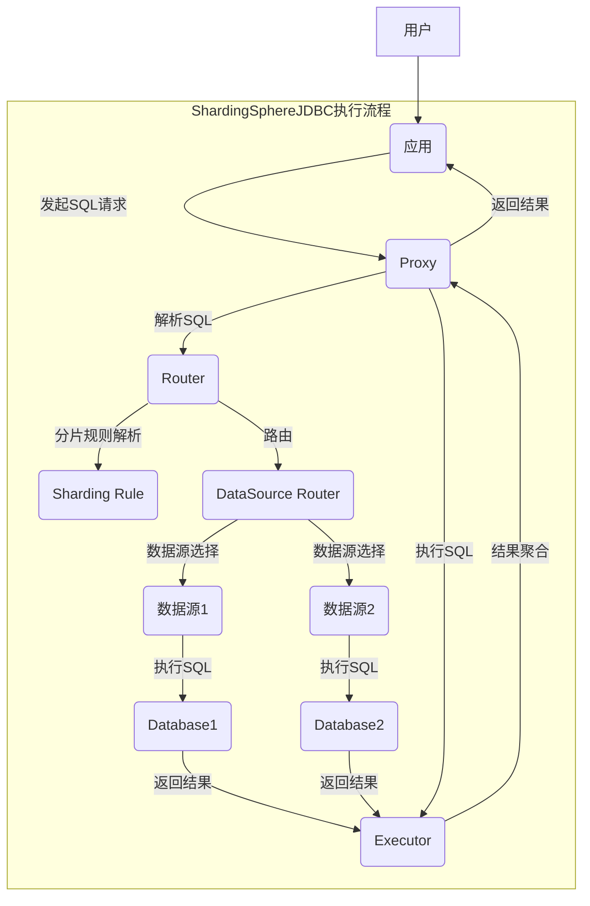

ShardingSphere是一种分布式数据库中间件，为了方便数据分片而设计，ShardingSphere-JDBC5是其中的一个子项目。它提供了对JDBC的扩展，允许在单个逻辑数据源上实现数据分片。

## 执行流程

ShardingSphere-JDBC主要由两部分组成：客户端和服务端。客户端的作用是将SQL解析后分发给不同的服务节点，服务端负责处理请求并返回结果。下面是执行流程图：

以上是整个执行流程，下面将详细介绍每一步的内容。

### 解析SQL

首先，客户端需要先解析用户提交的SQL语句，这里使用的是JSqlParser这个库。该库能够将SQL语句解析成一个AST（抽象语法树），然后我们可以从AST中提取出所有的表名、列名、操作符等信息。

### 获取分片规则

接下来，客户端需要获取分片规则。分片规则是由用户在配置文件中设置的，它指定了数据的分片方式，比如按照ID值进行分片，或者按照日期进行分片。客户端会将这些规则发送给服务端，以便服务端能够正确地处理请求。

### 生成分片执行计划

有了分片规则之后，客户端就可以根据每一条SQL语句生成一个分片执行计划了。执行计划包含了每个分片节点需要执行的SQL语句以及对应的参数值。这里使用了一个叫做ShardingEngine的核心类来生成执行计划。

### 执行SQL

客户端将执行计划发送到服务端之后，服务端就可以开始执行SQL语句了。服务端会根据执行计划中指定的SQL语句和参数值在对应的数据库节点上执行查询操作，并将结果返回给客户端。

### 合并结果

由于数据被分散到了多个节点上，所以服务端在执行SQL语句之后，需要将结果合并成一个整体的结果集。这里采用了JDBC的ResultSet接口来实现结果集的合并操作。

## 总结

ShardingSphere-JDBC5是一个非常实用的分布式数据库中间件，它能够帮助我们快速地实现数据分片，提高查询性能和吞吐量。整个项目架构清晰，核心类也比较简单易懂。使用ShardingSphere可以让我们更加专注于业务开发，而不需要过多地关注底层的数据分片实现细节。