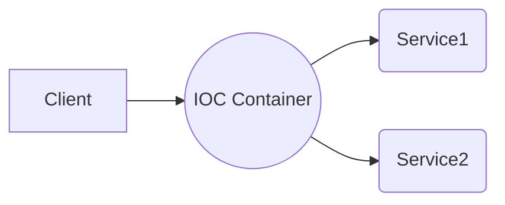

**Spring** 是一个开源的、轻量级的企业级应用框架，提供了许多常用功能，其中最重要的是 **IOC (Inverse of Control) 控制反转**。本文将着重介绍Spring IOC的相关概念、实现和使用方式。

## 什么是IOC？

IOC指“控制反转”，也叫依赖注入（Dependency Injection, DI）。它是一种设计思想，基于这个思想的框架就是IOC容器。在传统的编程中，对象的创建与对象间的依赖关系是由程序员自己管理和维护的。而在IOC容器中，由容器去负责创建对象，并且维护对象之间的依赖关系。

 IOC 控制反转的过程：



## Spring IOC容器

Spring IOC 容器就是一个对象工厂，它负责管理对象的创建、组装、初始化和销毁等过程。Spring 的 IOC 容器可以看做是一个大工厂，工厂里面可以生产各种不同类型的产品（对象），并且负责将这些对象推销出去（注入到其他对象中）。

### Spring IOC容器的实现

Spring IOC容器的实现主要分为两种方式：XML配置文件和注解。下面我们来逐一介绍。

#### XML 配置文件

在 Spring IOC 容器中，通过在 XML 配置文件中定义 bean 来描述对象之间的依赖关系。XML 配置文件中主要包含以下几个元素：

- `<beans>`：根元素，用于定义 Spring IOC 容器。
- `<bean>`：定义一个 bean 对象。
- `<property>`：为 bean 设置属性值。
- `<constructor-arg>`：通过构造方法注入属性值。
- `<import>`：导入其他配置文件。

下面是一个简单的 XML 配置文件示例：

```xml
<?xml version="1.0" encoding="UTF-8"?>
<beans xmlns="http://www.springframework.org/schema/beans"
       xmlns:xsi="http://www.w3.org/2001/XMLSchema-instance"
       xsi:schemaLocation="http://www.springframework.org/schema/beans http://www.springframework.org/schema/beans/spring-beans.xsd">
    <!-- 定义一个 HelloServiceImpl 对象 -->
    <bean id="helloService" class="com.example.service.impl.HelloServiceImpl">
        <!-- 为 HelloServiceImpl 设置属性值 -->
        <property name="message" value="Hello, Spring!" />
    </bean>
</beans>
```

#### 注解

除了使用 XML 配置文件来描述对象之间的依赖关系外，Spring 还支持使用注解的方式来实现 IOC。下面是一些常用的注解：

- `@Component`：标记一个类为组件（即 bean），通常与 `@Autowired` 一起使用。
- `@Repository`：标记一个类为 DAO（数据访问对象）。
- `@Service`：标记一个类为服务层组件。
- `@Controller`：标记一个类为控制器。

下面是一个使用注解的示例：

```java
@Service("helloService")
public class HelloServiceImpl implements HelloService {
    @Value("Hello, Spring!")
    private String message;

    public void sayHello() {
        System.out.println(message);
    }
}
```

### Spring IOC容器的使用

使用 Spring IOC 容器需要先创建容器对象，然后通过容器对象获取 bean 对象。

#### 创建容器对象

Spring IOC 容器有两种实现方式：`ClassPathXmlApplicationContext` 和 `AnnotationConfigApplicationContext`。其中，`ClassPathXmlApplicationContext` 用于加载 XML 配置文件，`AnnotationConfigApplicationContext` 用于加载注解。

下面是一个使用 `ClassPathXmlApplicationContext` 的示例：

```java
ApplicationContext context = new ClassPathXmlApplicationContext("classpath:applicationContext.xml");
```

#### 获取bean对象

容器对象创建好之后，我们就可以通过其提供的方法来获取 bean 对象了。下面是一些常用的方法：

- `getBean(String name)`：

- 根据 bean 的名称（id）获取 bean 对象。

  - `getBean(Class<T> requiredType)`：根据 bean 的类型获取 bean 对象。
  - `getBean(String name, Class<T> requiredType)`：根据 bean 的名称和类型获取 bean 对象。

  下面是一个使用 `getBean()` 方法获取 bean 对象的示例：

  ```java
  HelloService helloService = context.getBean("helloService", HelloService.class);
  ```

  ## Spring IOC容器的优点

  Spring IOC 容器主要有以下几个优点：

  1. 降低了组件之间的耦合度，提高了代码的可维护性和灵活性。
  2. 可以实现依赖性倒转原则（Dependency Inversion Principle, DIP），即高层模块不依赖于底层模块，两者都依赖于抽象；抽象不依赖于具体实现方式，具体实现方式依赖于抽象。
  3. 方便进行单元测试。由于对象的创建和依赖关系由 Spring IOC 容器负责管理，因此在进行单元测试时，可以将容器中的对象替换成模拟对象，从而方便地进行测试。
  4. 提高了代码的可读性和可维护性。由于对象之间的依赖关系在 XML 配置文件或注解中明确地表达出来，因此代码的逻辑关系更加清晰，易于理解和维护。

  ## 总结

  Spring IOC 容器是 Spring 框架的核心功能之一，它能够帮助开发者管理对象之间的依赖关系，提高代码的可维护性和可读性。通过本文的介绍，我们了解了 Spring IOC 的相关概念、实现方式和使用方法，相信读者已经对 Spring IOC 有了更深入的理解。
