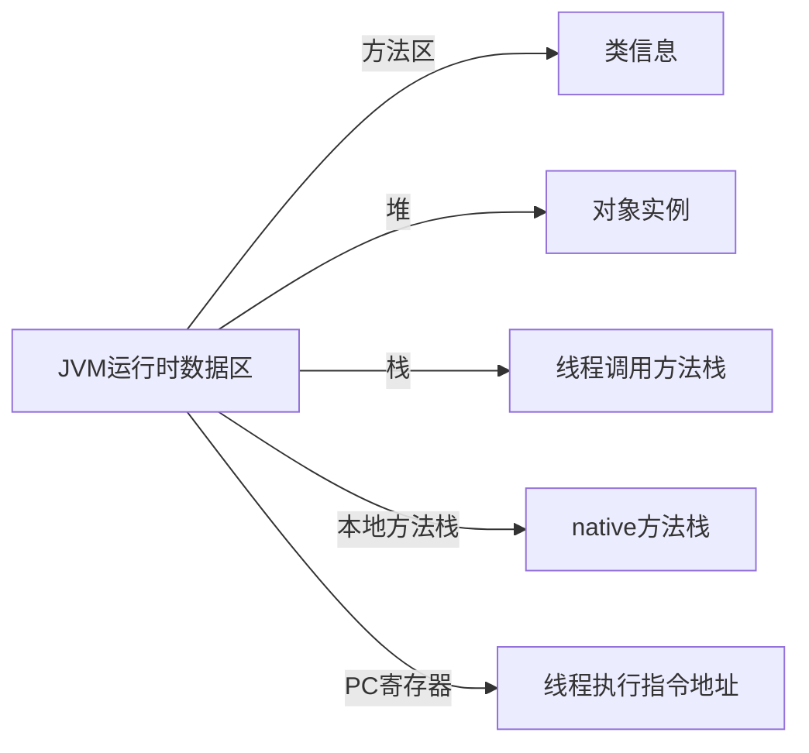

[^_^]: # (介绍建立个人博客的优势。)

## 一、建立个人博客有什么好处？



1. 独立性：有自己的域名和独立的空间，自己拥有所有的数据和掌控自己的博客内容。

2. 自由度：自由地控制自己的博客风格和布局，选择自己喜欢的主题和插件。

3. 用户体验：个人博客的访问速度较快，不会因为其他用户访问博客而崩溃或者卡顿。

4. 可定制性：可以根据自己的需求自由定制博客的功能，而不需要受到其他博客系统的限制。

5. 自我品牌：建立个人博客可以打造自己的个人品牌，展示自己的专业知识和经验。

CSDN和其他博客系统也有很多的好处，例如更方便，更稳定，更安全，更易于分享和推广，更容易获得关注和订阅等等。因此，建立个人博客还需根据自身的需求和实际情况而定。


[^_^]: # (JVM运行时数据区)

## 二、JVM运行时数据区




